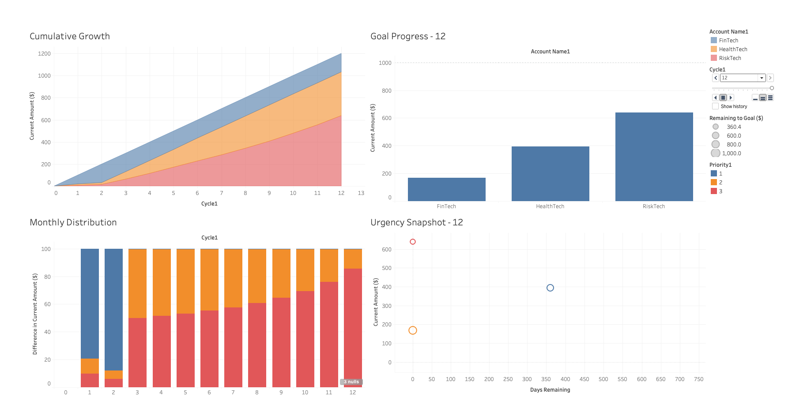

# Account Ninja 🥷

Account Ninja is a simple, client-side browser application designed to help you manage a list of financial accounts or goals. It allows you to prioritize these accounts, assign them a 3Zen weight ([how much sense they make](./CapitalScopeSocial.pdf)), and track urgency by days remaining. You can then distribute a lump sum of money across these accounts based on these factors.

## How to Run

1.  **Download Files:** Make sure you have `index.html`, `style.css`, and `script.js` in the same folder on your computer.
2.  **Open in Browser:** Open the `index.html` file directly in your web browser (e.g., Chrome, Firefox, Edge, Safari). No web server or special tools (like Node.js) are required.

## Features

* **Add Accounts:** Add new financial goals or accounts with:
    * Account Name
    * Goal Amount ($)
    * Priority (1 being the highest, lower numbers are higher priority)
    * 3Zen Weight (a float number between 1 and 3, representing importance or "sense")
    * Days Remaining (urgency factor)
* **Display List:** View all your accounts in a table showing:
    * Account Name
    * Goal Amount
    * Current Amount (editable directly in the table)
    * Remaining Amount to Reach Goal
    * Priority (editable)
    * 3Zen Weight (editable)
    * Days Remaining (editable)
* **Edit In-Place:** Modify the `Current Amount`, `Priority`, `3Zen Weight`, and `Days Remaining` for any account directly in the table. Changes are saved automatically.
* **Delete Accounts:** Remove accounts from your list.
* **Distribute Funds:**
    * Enter a total amount of money you wish to distribute.
    * Click "Distribute." The application will allocate this money across your accounts.
    * The distribution logic considers:
        1.  **Need:** Only accounts where `Current Amount` < `Goal Amount` are eligible.
        2.  **Priority:** Lower priority numbers get higher preference.
        3.  **3Zen Weight:** Higher 3Zen weights get more preference.
        4.  **Urgency (Days Remaining):** Fewer days remaining (higher urgency) get more preference.
        *The formula for an account's weight in the distribution is roughly `(3Zen Weight * Urgency) / Priority`.*
        *Funds are distributed proportionally based on these calculated weights. The process may iterate to distribute any remainder if accounts reach their goal during allocation.*
* **Data Persistence:** Your account list and current amounts are saved in your browser's **`localStorage`**. This means the data persists between sessions *on the same browser and computer*.

## Calculation Logic for Distribution

When you click "Distribute":
1.  The app identifies accounts that still need funding (Goal > Current).
2.  For each eligible account, a `calculatedWeight` is determined:
    `calculatedWeight = (3ZenWeight * (1 / (daysRemaining + 0.001))) / priority`
    *(A small epsilon, 0.001, is added to daysRemaining to prevent division by zero and ensure 0 days has the highest urgency).*
3.  The total amount to distribute is then divided among eligible accounts based on the proportion of their `calculatedWeight` relative to the sum of all `calculatedWeight`s.
4.  An account will not receive more than its `goalAmount - currentAmount`.
5.  The distribution process may run in passes to attempt to allocate the full distribution amount if initial allocations fill up some accounts, freeing up funds for others still in need.

## Important Limitations

* **No True SQLite Database:** This app uses `localStorage`, which is built into your web browser.
    * Data is stored **locally** in your browser. It is not a separate `.sqlite` file that you can easily move or access with other database tools.
    * If you clear your browser's cache/data, or use a different browser or computer, your Account Ninja data will not be there.
* **Client-Side Only:** All logic (calculations, data storage) happens within your web browser. There is no backend server.
* **Manual Priority Management:** You are responsible for setting and managing the `Priority` numbers. The application uses these numbers as provided; it does not automatically re-sequence them if an item is deleted or if numbers are not unique/sequential (though non-unique priorities will simply share the same priority level in calculations).
* **Error Handling:** Basic validation is in place, but it's a simple app, not a robust commercial product.

## Timeline Simulation & Forecasting

Beyond managing your current account state, Account Ninja includes a powerful forecasting tool that simulates future distributions over time. This helps you answer the question: **"If I contribute a fixed amount regularly, what will my accounts look like in the future, and how long will it take to reach my goals?"**

### How to Use the Timeline Simulation

1.  **Set Your Initial State:** Make sure the accounts listed in the app reflect the starting point for your simulation.
2.  **Enter Simulation Parameters:** Use the **Live Distribution & Simulation Controls** to set your simulation variables:
    * **Amount per Cycle ($):** Enter the fixed amount of money you want to distribute in each period (e.g., your monthly contribution).
    * **Cycles:** Enter the number of periods you want to simulate (e.g., enter `24` to simulate for two years, assuming one cycle is one month).
3.  **Generate the Timeline:** Click the **Download Timeline Simulation** button. This will generate and download a detailed CSV file (`account_ninja_timeline.csv`).

**Important:** This simulation runs on a temporary copy of your data. **It does not change your live data** displayed on the app screen.

### Understanding the Simulation Logic

When you generate a timeline, the app performs the following steps for each cycle in your simulation:

1.  **Distributes Funds:** It runs the standard distribution algorithm using your "Amount per Cycle" value.
    * **Special Rule:** For the simulation, any account with **0 or fewer 'Days Left'** is considered expired and is **excluded** from receiving any funds, regardless of its priority or goal.
2.  **Advances Time:** After the distribution, it reduces the "Days Left" for *every* account by **30 days**.
3.  **Records the State:** It saves a snapshot of every account's details for that cycle.
4.  **Repeats:** It repeats this process for the number of cycles you requested. The simulation will stop early if all goals are met or if all remaining accounts have run out of time.

### Analyzing the Output (`account_ninja_timeline.csv`)

The exported CSV file gives you a period-by-period view of the simulation.

* **Cycle 0:** The file begins with "Cycle 0," which is the **initial state** of your accounts *before* the first distribution. This provides a clear baseline for your analysis.
* **Subsequent Cycles:** Each subsequent cycle number (1, 2, 3, etc.) shows the state of each account *after* that cycle's distribution and time advance have occurred.

By analyzing this CSV in a tool like Microsoft Excel, Google Sheets, or Tableau, you can gain valuable insights:

* **Projected Goal Completion:** Identify the exact cycle when an account's `Current Amount` meets its `Goal Amount`.
* **Urgency Analysis:** See when an account's `Days Remaining` hits zero and how that affects the distribution to other accounts.
* **Visualize Growth:** Plot the `Current Amount` against the `Cycle` for each account to visualize their growth curves over time.

Enjoy managing your accounts like a Ninja! 🥷💰

and check out the [Tableau Interactive Dashboard](./account-ninja-timeline.twb) as a way to watch your timeline.

