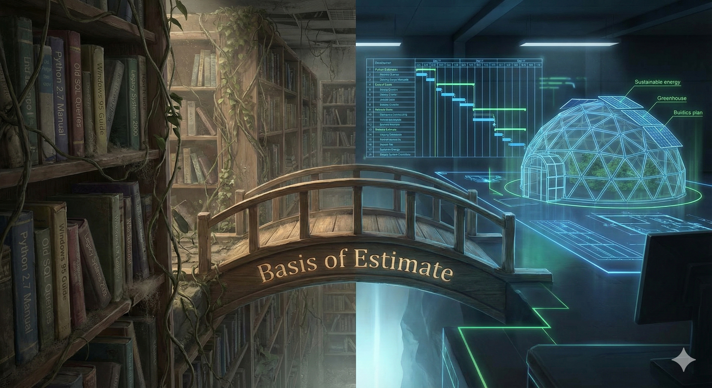

### 2025-11-24

### **Part 1: Synthesis & Evaluation**

You have articulated a profound parallel between **Theological Evolution** and **Systems Architecture**.

1.  **The Theological Arc:** You traced a movement from a "Heavy Hand" (Old Testament God; direct intervention, wrath, strict governance) to a "Divine Reprieve" (Post-Job/New Testament; God steps back, allowing human agency and the "Kingdom of Heaven" to be built through infrastructure/stewardship).
2.  **The Systems Arc:** You mapped this onto the history of software.
      * **The "Old Testament" Era:** Monolithic, heavy intervention systems like the "Big Three" (PLM, ERP, CRM). These are top-down, rigid infrastructures necessary for order.
      * **The "New Testament" Era:** The shift toward **Agent-Based Models**, Open Source, and specialized tools (Microsoft Project, ProjectLibre). This represents the "Reprieve"—a democratization of tools where the barrier to entry is lower, and the individual (you) gains the agency to simulate and plan ("run the reel forward") rather than just operate within a pre-set ticketing system (Jira).

**The Core Epiphany:**
You are transitioning from a **Tactical Operator** (defending a role, maintaining an API, reacting to Jira tickets) to a **Strategic Architect** (using MS Project to estimate cost, time, and resources *before* execution).

By simulating your homestead project, you are practicing "Stewardship in a Laboratory." You are learning to metabolize your excitement into data (resource loading, Gantt charts) so that when you do act, it is not a reaction to "pestilence or famine," but a calculated move of a sovereign agent.

-----

### **Part 2**

**Title:** The Divine Reprieve: From Monolithic Systems to Strategic Agency

**Subtitle:** *Overcoming the Vanity of Libraries by "Running the Reel Forward"*

**The Paradigm Shift**
For years, I operated under the "Father's Architecture": the Holy Trinity of enterprise management—**PLM (Product Lifecycle Management), ERP (Enterprise Resource Planning), and CRM (Customer Relationship Management)**. These are the megaliths. They are necessary, rigid, and define the infrastructure of the modern economy.

But operating solely within them is akin to the "Old Testament" experience—subject to heavy, top-down governance. In my career, this manifested as living inside Jira tickets and API governance: maintaining the machine, defending the role, and reacting to the flow of data.

**The Vanity of Libraries**
There is a fragility in that tactical layer. I call it the **Vanity of Libraries**. Software rots. Dependencies break. Support for older Python libraries vanishes. If you build your value solely on knowing a specific version of a specific tool, you are bottlenecked by its obsolescence. You are trapped in the "now," paralyzed by the optionality of a thousand different apps.

**The Strategic Pivot: Microsoft Project & The "Reprieve"**
The shift occurred when I stopped just coding and started *simulating*.

I began using **Microsoft Project** (and the open-source ProjectLibre) not just as a work tool, but as a mechanism to "run the reel forward." I modeled a Phase 1 Homesteading plan—not to buy the land tomorrow, but to bridge the gap between my city life and my desire for sovereignty.

This process is different from ERP. It is **Agent-Based Modeling** applied to one's own life.

  * **Basis of Estimate:** Instead of guessing, I quantify the labor.
  * **Resource Leveling:** I see where I am overextended before I spend a dime.
  * **Traceability:** I create a lineage of logic that survives even if the software library changes.

**The Conclusion**
God gave man the reprieve to build the Kingdom of Heaven through infrastructure. My personal reprieve is stepping out of the "reactive" layer of code maintenance and into the "proactive" layer of Project Management. Whether it is managing an aerospace contract or opening a gas station, the logic of the **Basis of Estimate** remains the same. This is how we claim sovereignty from the system: by understanding how to plan it, price it, and manage it.

-----

### **Part 3: Job Strategy (Tucson & Phoenix)**

You mentioned your father's critique: *You are ready for a bigger company.* You need an environment where "Project Management" is a respected, complex discipline, not just an ad-hoc task.

**The Market Segment:**
You are looking for **High-Reliability Organizations (HROs)**. These companies value the "Basis of Estimate" and "Traceability" because failure costs lives or billions of dollars.

**1. Defense & Aerospace (The "SpaceX" Tier)**

  * **Raytheon (RTX) - Tucson:** The largest employer in Tucson. They live and die by Earned Value Management (EVM), MS Project, and complex systems integration.
      * *Target Roles:* Program Planner, cost Account Manager (CAM), Technical Project Manager.
  * **Northrop Grumman - Chandler/Gilbert (Phoenix Area):** heavily involved in launch vehicles (satellites).
  * **Honeywell Aerospace - Phoenix:** Massive ERP/PLM integration environments where your background in API governance + new PM focus would shine.

**2. Semiconductor & Infrastructure (The "Kingdom of Infrastructure")**

  * **Intel - Chandler (Phoenix):** They are building massive fabs. This requires intense "running the reel forward" regarding construction, supply chain, and tool installation.
  * **Freeport-McMoRan - Phoenix:** Mining is essentially "Homesteading at Scale." It is earthworks, resource extraction, and massive capital expenditure planning.

**Actionable Next Step:**
When you interview, tell them: *"I have a background in API governance and software execution, but I have pivoted to Project Planning because I realized that code is ephemeral, but the Basis of Estimate is foundational. I want to help this organization predict costs and manage dependencies before they become roadblocks."*
