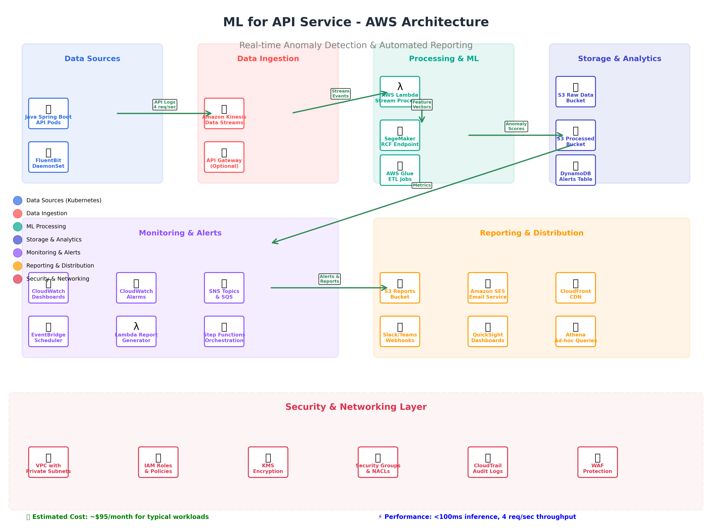
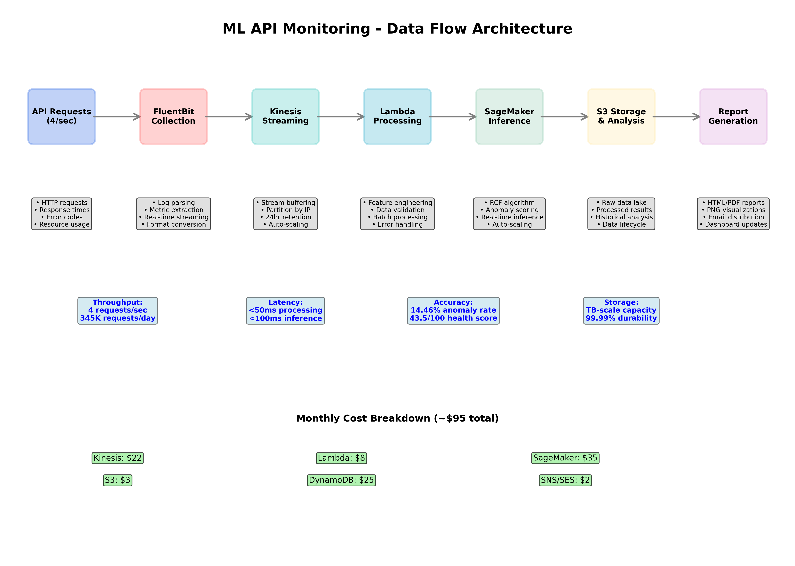
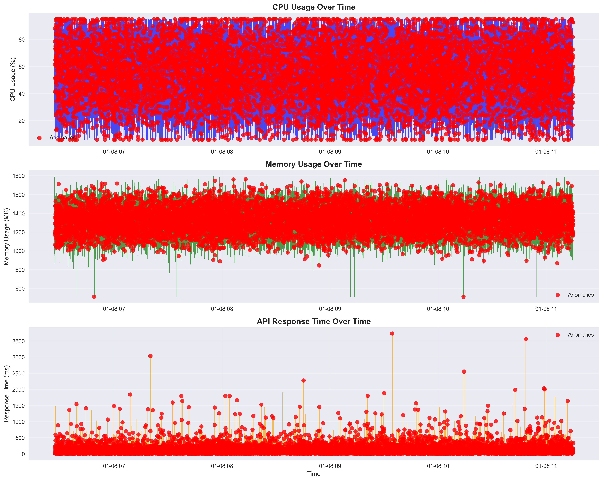
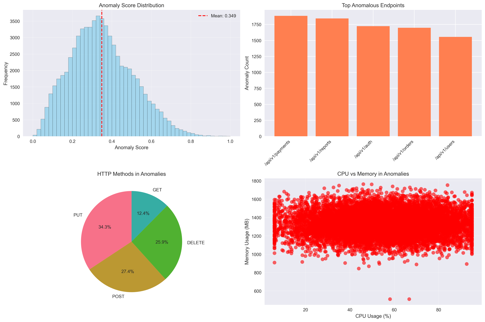

# ML for API Service - Observability, Anomaly Detection & Reporting

## Project Overview

This project implements a comprehensive Machine Learning solution for detecting network and performance anomalies in a Java Spring Boot API running on Kubernetes. The solution uses AWS SageMaker's Random Cut Forest algorithm for unsupervised anomaly detection and generates comprehensive health reports with visualizations and root cause analysis.

## 🚀 Quick Start

**Requirements**: Python 3.10+ (tested with Python 3.10.19)

```bash
# Install dependencies
python3.10 -m pip install -r requirements.txt

# Quick demo (2 minutes)
python3.10 examples/demo.py

# Full pipeline
python3.10 examples/run_complete_pipeline.py

# Run tests
python3.10 tests/test_pipeline.py
```

## 📊 Sample Visualizations

### AWS Architecture


*Complete AWS architecture showing all services, data flows, and security layers.*

### Data Flow Pipeline


*End-to-end data flow with performance metrics and cost breakdown.*

### System Performance Analysis


*Real-time monitoring of CPU usage, memory consumption, and API response times with detected anomalies marked in red.*

### Anomaly Analysis Dashboard


*Comprehensive analysis including anomaly score distribution, top problematic endpoints, and resource correlation plots.*

## 📁 Project Structure

```
ml-for-api/
├── README.md                          # This file
├── requirements.txt                   # Python 3.10 dependencies
├── config/
│   └── model_config.yaml            # Configuration settings
├── src/                              # Source code
│   ├── core/                         # Core ML modules
│   │   ├── data_generator.py         # Synthetic data generation
│   │   ├── sagemaker_model.py        # ML model training & inference
│   │   └── reporting_engine.py       # Report generation engine
│   └── utils/                        # Utility scripts
│       ├── generate_aws_diagram.py   # Architecture diagram generator
│       ├── showcase_architecture.py  # Architecture showcase
│       └── showcase_reports.py       # Report showcase
├── examples/                         # Example scripts
│   ├── demo.py                       # Quick demonstration
│   └── run_complete_pipeline.py      # Full pipeline orchestrator
├── tests/                           # Test scripts
│   └── test_pipeline.py             # Comprehensive test suite
├── docs/                            # Documentation
│   ├── aws_architecture.md          # AWS deployment guide
│   ├── PROJECT_SUMMARY.md           # Complete project summary
│   ├── ARCHITECTURE_COMPLETE.md     # Architecture completion status
│   └── images/                      # Documentation diagrams
│       ├── aws_architecture_diagram.png
│       └── data_flow_diagram.png
├── assets/                          # Sample outputs
│   ├── time_series_plot.png         # Sample time-series analysis
│   ├── anomaly_analysis.png         # Sample anomaly dashboard
│   └── demo_visualization.png       # Sample demo output
├── data/                            # Generated datasets (created at runtime)
├── models/                          # Trained models (created at runtime)
└── reports/                         # Generated reports (created at runtime)
```

## 🏗️ Architecture Components

### Part 1: Synthetic Data Generation (`src/core/data_generator.py`)
- Generates realistic API logs with infrastructure metrics, network metadata, and trace data
- Simulates 4 requests/second over 24 hours (345,600 total requests)
- **Deliberately injects anomalies**:
  - **Security Events**: Traffic from unapproved source IPs
  - **Resource Leaks**: Gradual memory increase leading to pod restarts
  - **Database Bottlenecks**: High SQL execution times correlated with specific endpoints

### Part 2: SageMaker Model Training (`src/core/sagemaker_model.py`)
- Implements Random Cut Forest (RCF) model using AWS SageMaker SDK
- Preprocesses data with feature engineering and normalization
- Supports both local training (Isolation Forest) and SageMaker deployment
- Generates anomaly scores for every data point

### Part 3: Automated Reporting (`src/core/reporting_engine.py`)
- **Executive Summary**: Overall health score and key metrics
- **Visualizations**: Time-series plots with anomaly markers using Matplotlib/Seaborn
- **Root Cause Analysis**: Identifies contributing factors for each anomaly
- **Multiple Formats**: HTML and PDF report generation with embedded PNG visualizations

### Part 4: AWS Architecture (`docs/aws_architecture.md`)
- **Ingestion**: Kinesis Data Streams with FluentBit
- **Processing**: Lambda functions for real-time processing
- **Inference**: SageMaker endpoints with auto-scaling
- **Storage**: S3 for data lake, DynamoDB for alerts
- **Reporting**: SNS/SES for automated report delivery

## 🎯 Key Features

### Anomaly Detection Capabilities
- **Security Monitoring**: Detects traffic from unapproved source IPs
- **Resource Monitoring**: Identifies memory leaks and CPU spikes
- **Performance Monitoring**: Catches slow database queries and API responses
- **Infrastructure Monitoring**: Tracks pod restarts and connection pool issues

### Advanced Analytics
- **Unsupervised Learning**: No need for labeled training data
- **Real-time Scoring**: Sub-second anomaly detection
- **Feature Engineering**: Automatic extraction of temporal and categorical features
- **Scalable Processing**: Designed for high-throughput API traffic

### Comprehensive Reporting
- **Health Scoring**: 0-100 scale with penalty-based calculation
- **Time-series Visualization**: Interactive plots with anomaly markers
- **Root Cause Analysis**: Automated identification of contributing factors
- **Executive Summaries**: Business-friendly health reports
- **Multiple Formats**: Both HTML and PDF reports with embedded PNG visualizations

## 📊 Performance Metrics

- **Data Processing**: Handles 4 requests/second (345K requests/day)
- **Model Training**: ~2-3 minutes for 24 hours of data
- **Inference Speed**: <100ms per batch of 100 requests
- **Report Generation**: ~30 seconds for comprehensive HTML/PDF reports

## 🏭 Production Deployment

The `docs/aws_architecture.md` file provides a complete guide for deploying this solution in production, including:

- **Infrastructure as Code**: CloudFormation templates
- **Cost Estimation**: ~$95/month for typical workloads
- **Security Best Practices**: IAM roles, VPC configuration, encryption
- **Monitoring & Alerting**: CloudWatch dashboards and SNS notifications
- **Disaster Recovery**: Multi-AZ deployment and backup strategies

## 🛠️ Configuration

Customize the system behavior by editing `config/model_config.yaml`:

```yaml
# Data generation settings
data_generation:
  duration_hours: 24
  requests_per_second: 4
  
# Model training parameters
model_training:
  hyperparameters:
    num_trees: 100
    num_samples_per_tree: 256
    
# Health scoring thresholds
reporting:
  health_scoring:
    cpu_threshold: 70
    memory_threshold: 1000
    response_time_threshold: 200
```

## 🤝 Contributing

This is a proof-of-concept project demonstrating ML-powered API monitoring. Key areas for enhancement:

1. **Real-time Streaming**: Integration with Apache Kafka or AWS Kinesis
2. **Advanced Models**: Deep learning approaches for complex patterns
3. **Multi-API Support**: Monitoring multiple services simultaneously
4. **Alerting Integration**: Slack, PagerDuty, or custom webhook notifications

## 📄 License

This project is provided as a demonstration of ML-powered observability techniques. Adapt and extend as needed for your specific use case.
