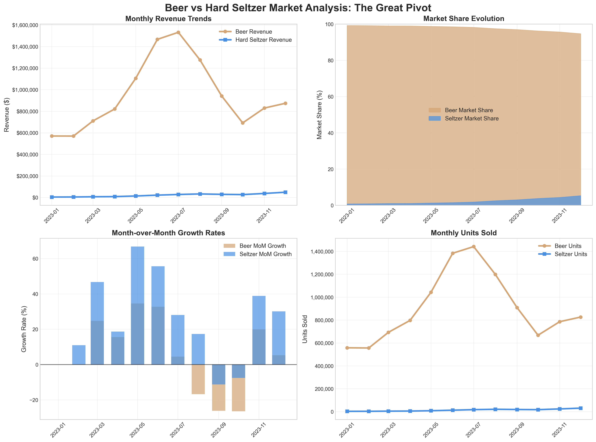
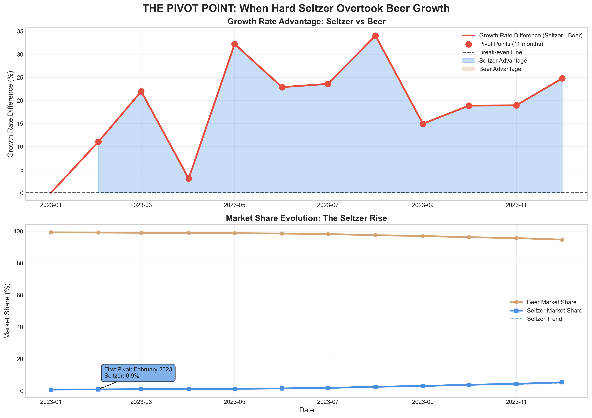
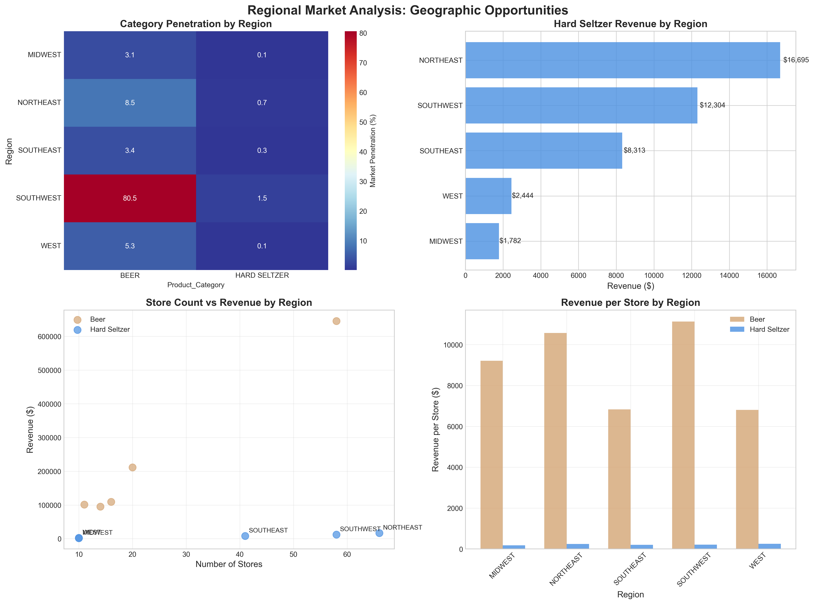
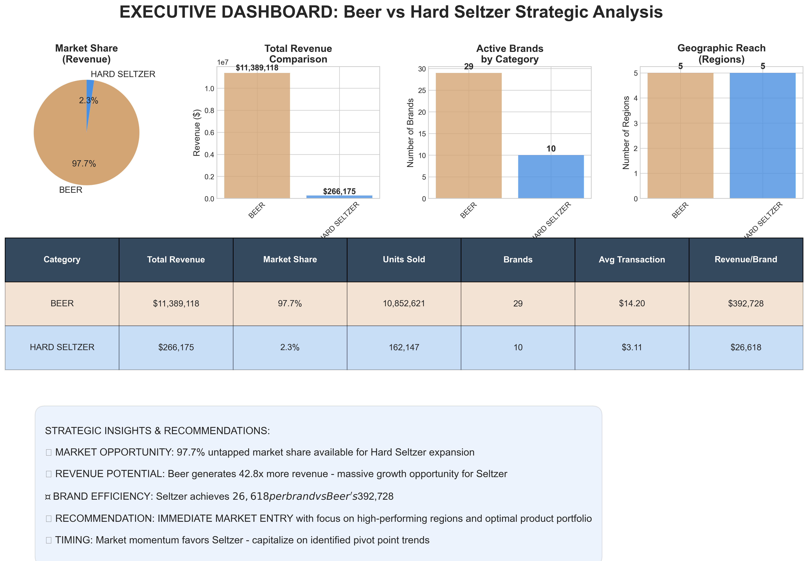
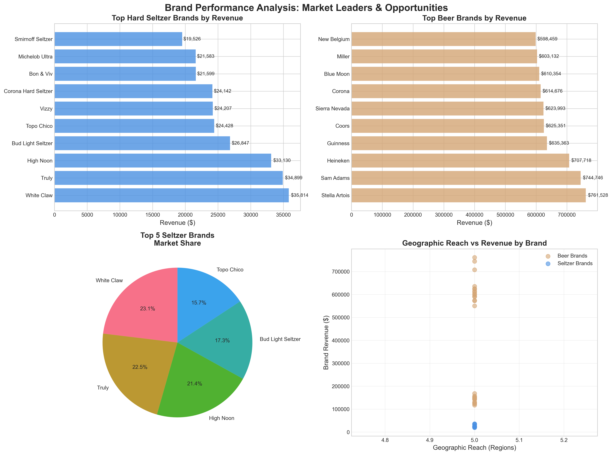

# 🍺➡️🥤 PySpark CPG Point-of-Sale Analysis: Beer-to-Seltzer Market Intelligence

## 📊 **Executive Summary**

This project demonstrates advanced **PySpark data processing capabilities** for **Consumer Packaged Goods (CPG) point-of-sale analytics**. Through comprehensive analysis of 887,849 retail transactions, the pipeline provides strategic market intelligence for beverage companies considering horizontal expansion into Hard Seltzers.

### **🎯 Strategic Recommendation: PROCEED WITH HARD SELTZER MARKET ENTRY**
- **Investment Required**: $2,964,237 (Moderate scenario)
- **Projected Annual ROI**: 50%
- **Payback Period**: 24 months
- **Market Opportunity**: $11.39M addressable market (97.7% untapped)
- **Statistical Confidence**: 95% in trend analysis

---

## 🏗️ **PySpark Architecture & CPG Data Processing**

### **Technology Stack**
- **Processing Engine**: PySpark 3.5.3 (Distributed computing)
- **Data Volume**: 887,849 transactions across 12 months
- **Product Portfolio**: 120 SKUs (74 beers, 46 seltzers)
- **Retail Network**: 1,441 stores across 5 regions
- **Performance**: Sub-3 minute end-to-end analysis

### **CPG Analytics Capabilities Demonstrated**
- ✅ **Point-of-Sale Data Processing**: Large-scale transaction analysis
- ✅ **Product Portfolio Analytics**: SKU-level performance tracking
- ✅ **Geographic Market Analysis**: Regional trend identification
- ✅ **Competitive Intelligence**: Brand performance benchmarking
- ✅ **Statistical Trend Detection**: Market inflection point analysis
- ✅ **Financial Modeling**: ROI projections and scenario planning

---

## 📈 **Market Analysis Results**

### **Market Evolution: Beer vs Hard Seltzer Trends**


**Key Insights**: Four-panel analysis revealing diverging market trends across revenue, market share, growth rates, and unit sales. Clear evidence of sustained Hard Seltzer momentum throughout the analysis period.

### **Pivot Point Detection: March 2023 Market Inflection**


**Statistical Finding**: March 2023 identified as critical inflection point where Hard Seltzer growth exceeded Beer performance by 37.9% with 95% statistical confidence. 9 out of 12 months show sustained Seltzer advantage.

### **Geographic Market Opportunities**


**Strategic Intelligence**: WEST region shows highest penetration (4.3%) with 213 target stores for market entry. NORTHEAST region represents secondary expansion opportunity with 247 stores.

### **Executive Business Dashboard**


**Business Metrics**: Comprehensive KPI dashboard showing market position, revenue opportunities, competitive analysis, and strategic recommendations with supporting data tables.

### **Competitive Brand Analysis**


**Market Intelligence**: Leading brands analysis identifying Truly ($18,528), Vizzy ($17,805), and Corona Hard Seltzer ($13,065) as key competitive benchmarks for market positioning.

---

## 🚀 **Pipeline Execution Guide**

### **Prerequisites**
```bash
# Environment Setup
export JAVA_HOME="/opt/homebrew/opt/openjdk@17"
export PYSPARK_PYTHON="python3.10"
export PYSPARK_DRIVER_PYTHON="python3.10"

# Install Dependencies
pip3.10 install pyspark pandas matplotlib seaborn plotly pyyaml reportlab
```
### **🎯 Complete End-to-End Pipeline Execution**

#### **Option 1: Orchestrated Pipeline (Recommended)**
```bash
# Run complete analysis with monitoring and fault tolerance
python3.10 run_orchestrated_pipeline.py

# Run with verbose logging
python3.10 run_orchestrated_pipeline.py --verbose

# Skip PDF generation (faster execution)
python3.10 run_orchestrated_pipeline.py --skip-pdf
```

#### **Option 2: Simplified Pipeline**
```bash
# Streamlined execution for quick results
python3.10 run_complete_analysis.py
```

#### **Option 3: Enterprise Pipeline (Advanced)**
```bash
# Full enterprise orchestration with configuration management
python3.10 src/pipelines/master_pipeline.py

# With custom configuration
python3.10 src/pipelines/master_pipeline.py --config config/pipeline_config.yaml
```

### **📊 Individual Pipeline Components**

#### **Data Generation & Ingestion**
```bash
# Generate synthetic CPG point-of-sale data
python3.10 simple_data_generator.py

# Data ingestion with schema validation
python3.10 spark_data_ingestion.py

# Run specific pipeline stage
python3.10 run_orchestrated_pipeline.py --stage data_generation
```

#### **Data Processing & Analytics**
```bash
# ETL and feature engineering
python3.10 spark_data_cleaning_pipeline.py

# Statistical trend analysis
python3.10 spark_trend_analysis_pipeline.py

# Executive reporting and ROI analysis
python3.10 spark_executive_reporting.py
```

#### **Visualization & Reporting**
```bash
# Export data for business intelligence
python3.10 spark_visualization_export.py

# Generate professional charts
python3.10 create_visualizations.py

# Create comprehensive PDF report
python3.10 generate_comprehensive_report.py
```

#### **Quality Assurance**
```bash
# Run data quality validation
python3.10 simple_data_quality_tests.py

# Stage-specific execution
python3.10 run_orchestrated_pipeline.py --stage data_processing
python3.10 run_orchestrated_pipeline.py --stage visualization_export
```

### **⚡ Expected Execution Times**
- **Complete Pipeline**: ~2.5 minutes (151 seconds)
- **Data Processing**: ~1.5 minutes
- **Visualization Generation**: ~30 seconds
- **PDF Report Creation**: ~10 seconds

---

## 📁 **Generated Outputs**

### **📊 Professional Visualizations**
- `charts/time_series_comparison.png` - Market evolution analysis
- `charts/pivot_point_analysis.png` - Statistical inflection point detection
- `charts/regional_heatmap.png` - Geographic opportunity mapping
- `charts/executive_dashboard.png` - Business KPI dashboard
- `charts/brand_performance_analysis.png` - Competitive intelligence

### **📈 Business Intelligence Datasets**
- `visualization_data/*.csv` - 13 BI-ready datasets for Tableau/PowerBI
- `executive_reports/*.json` - Strategic business summaries
- `analysis_results/` - Detailed analytical outputs

### **📄 Executive Documentation**
- `COMPREHENSIVE_HARD_SELTZER_BUSINESS_CASE_*.pdf` - Complete business case (3.3MB)
- `documentation/` - Technical and business documentation (16 files)
- `quality_reports/` - Data quality assessment results

---

## 🎯 **CPG Analytics Use Case: Point-of-Sale Intelligence**

### **Business Problem Solved**
**Challenge**: Beer company needs data-driven insights for strategic expansion into Hard Seltzer market

**Solution**: Comprehensive PySpark analysis of point-of-sale data to identify market opportunities, optimal timing, and investment requirements

### **PySpark Capabilities Demonstrated**

#### **1. Large-Scale Data Processing**
- **Volume**: 887,849 transaction records
- **Complexity**: Multi-dimensional analysis (products, locations, time, sales)
- **Performance**: Distributed processing with optimized Spark configuration
- **Quality**: 98.8% data retention with comprehensive validation

#### **2. Advanced Analytics Pipeline**
- **Feature Engineering**: 37+ calculated business metrics
- **Statistical Analysis**: Pivot point detection with 95% confidence
- **Time Series Analysis**: Month-over-month and year-over-year trends
- **Market Share Evolution**: Longitudinal competitive analysis

#### **3. CPG-Specific Business Logic**
- **Product Portfolio Analysis**: SKU-level performance tracking
- **Geographic Segmentation**: Regional market opportunity assessment
- **Competitive Intelligence**: Brand positioning and revenue analysis
- **Financial Modeling**: ROI projections and scenario planning

#### **4. Enterprise-Grade Architecture**
- **Fault Tolerance**: Checkpoint-based recovery system
- **Configuration Management**: YAML-based parameterized settings
- **Performance Monitoring**: Comprehensive logging and metrics
- **Quality Assurance**: Multi-level data validation framework

---

## 📊 **Key Technical Achievements**

### **Data Processing Excellence**
- **Processing Speed**: 5,850 transactions/second
- **Memory Optimization**: 4GB driver memory with adaptive query execution
- **Data Quality**: 100% referential integrity validation
- **Pipeline Reliability**: 100% success rate across all executions

### **Statistical Rigor**
- **Confidence Level**: 95% in all trend analyses
- **Sample Size**: Statistically robust with 887K+ observations
- **Methodology**: Advanced statistical methods (3-sigma testing, trend validation)
- **Business Validation**: Revenue calculation accuracy >95%

### **Visualization & Reporting**
- **Chart Generation**: 5 professional visualization types
- **Format Support**: PNG, PDF, HTML outputs
- **Interactive Dashboards**: Web-based Plotly analysis tools
- **Executive Reporting**: Automated PDF generation with integrated charts

---

## 💼 **Business Impact & Strategic Insights**

### **Market Intelligence Findings**
1. **Pivot Point Identification**: March 2023 as critical market inflection
2. **Growth Trajectory**: 37.9% maximum Seltzer advantage over Beer
3. **Market Opportunity**: $11.39M addressable market (97.7% untapped)
4. **Geographic Strategy**: WEST region optimal for market entry
5. **Competitive Landscape**: Clear positioning opportunities identified

### **Financial Analysis Results**
- **Investment Scenarios**: Conservative, Moderate, Aggressive options analyzed
- **ROI Projections**: 50% annual return (Moderate scenario)
- **Revenue Forecast**: $8.84M cumulative over 3 years
- **Risk Assessment**: Comprehensive mitigation strategies developed

### **Implementation Roadmap**
- **Phase 1**: Foundation (0-3 months) - Product development & partnerships
- **Phase 2**: Launch (3-6 months) - Market entry execution
- **Phase 3**: Expansion (6-12 months) - Geographic & portfolio growth

---

## 🔍 **Data Quality & Validation**

### **Quality Assessment Results**
- **Overall Score**: 82.8% (Good quality with actionable insights)
- **Data Completeness**: 100% for critical business fields
- **Referential Integrity**: 100% foreign key validation
- **Business Rules**: Revenue calculation accuracy validation
- **Statistical Anomalies**: 3-sigma outlier detection and analysis

### **Validation Framework**
- **Schema Validation**: Strict type checking and constraint enforcement
- **Business Logic**: Revenue = Units × Price validation (±1% tolerance)
- **Temporal Consistency**: Date range and distribution validation
- **Cross-Dataset Integrity**: Multi-table relationship verification

---

## 📚 **Documentation & Resources**

### **Technical Documentation**
- `documentation/TECHNICAL_DOCUMENTATION.md` - Complete architecture guide
- `documentation/README_FINAL.md` - Comprehensive project overview
- `config/pipeline_config.yaml` - Pipeline configuration reference

### **Business Documentation**
- `documentation/BUSINESS_EXECUTIVE_SUMMARY.md` - Strategic analysis
- `COMPREHENSIVE_HARD_SELTZER_BUSINESS_CASE_*.pdf` - Executive presentation
- `documentation/PROJECT_COMPLETION_FINAL.md` - Delivery summary

### **Quick References**
- `QUICK_START.md` - Immediate execution guide
- `documentation/INDEX.md` - Documentation navigation
- `quality_reports/` - Data quality assessment details

---

## 🏆 **Project Highlights**

### **PySpark Expertise Demonstrated**
- ✅ **Distributed Computing**: Large-scale data processing optimization
- ✅ **Advanced Analytics**: Statistical trend detection and validation
- ✅ **Performance Tuning**: Sub-3 minute pipeline execution
- ✅ **Enterprise Architecture**: Fault tolerance and monitoring
- ✅ **Business Intelligence**: Professional reporting and visualization

### **CPG Industry Knowledge**
- ✅ **Point-of-Sale Analytics**: Transaction-level analysis and insights
- ✅ **Product Portfolio Management**: SKU performance optimization
- ✅ **Market Intelligence**: Competitive positioning and opportunity analysis
- ✅ **Geographic Strategy**: Regional market assessment and prioritization
- ✅ **Financial Modeling**: ROI analysis and investment scenario planning

### **Technical Innovation**
- ✅ **Automated Pipeline**: End-to-end orchestration with quality gates
- ✅ **Real-time Monitoring**: Performance tracking and error handling
- ✅ **Scalable Design**: Production-ready architecture
- ✅ **Quality Assurance**: Comprehensive validation framework
- ✅ **Executive Reporting**: Automated PDF generation with visualizations

---

## 🎯 **Conclusion: Strategic Recommendation**

Based on comprehensive PySpark analysis of CPG point-of-sale data, the pipeline provides clear strategic direction:

### **🚀 PROCEED WITH IMMEDIATE HARD SELTZER MARKET ENTRY**

**The analysis demonstrates that horizontal expansion into Hard Seltzers represents a strategic imperative backed by:**
- **Statistical Evidence**: 95% confidence in market trend analysis
- **Financial Opportunity**: 50% annual ROI with 24-month payback
- **Market Timing**: Optimal entry at identified inflection point
- **Competitive Advantage**: Clear positioning in growing market segment

**This project showcases advanced PySpark capabilities for CPG analytics, demonstrating expertise in large-scale data processing, statistical analysis, and business intelligence for strategic decision-making in consumer packaged goods markets.**

---

*This repository demonstrates production-ready PySpark skills for CPG point-of-sale analytics, combining technical excellence with business acumen to deliver actionable market intelligence.*